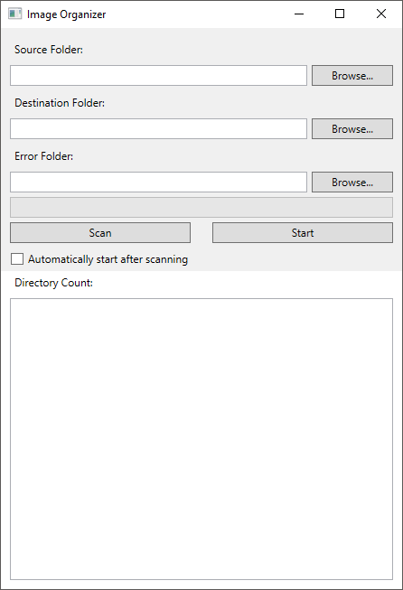

# ImageOrganizer

Image Organizer is the best way to handle your unsorted images. You can check out the [Releases](https://github.com/aschbacd/ImageOrganizer/releases) to download the final builds.

